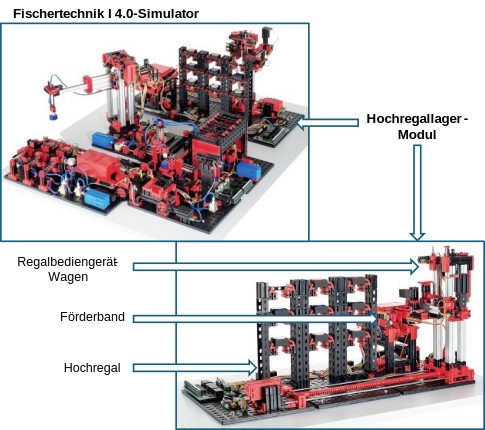
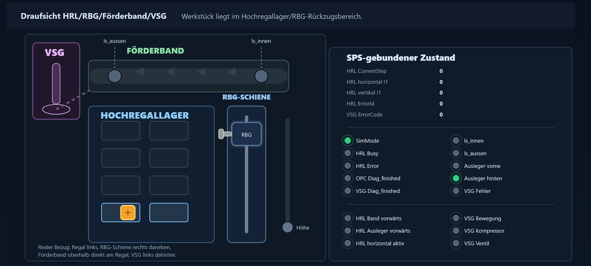

# Fischertechnik I4.0 HRL Simulation for TwinCAT

This repository contains a Python-based simulator and operator interface for a
Fischertechnik I4.0 demonstrator scenario. It was created as part of a master's
thesis and was used together with the Manufacturing ExcH Agents project:

https://github.com/verkal1999/Manufacturing-ExcH-Agents

The simulator supports an application example in which an agent-based error
handling workflow is evaluated on a high-bay warehouse module (Hochregallager). The original
setup is based on the Fischertechnik 24 V factory simulation and a Beckhoff
TwinCAT PLC program. Because a laboratory test on the physical PLC setup was
affected by a PLC-related issue, this repository provides a simulation layer for
the PLC-side signals and skill execution flow.



## Purpose

The project reproduces a representative material handling process of the
high-bay warehouse module. The simulated process focuses on the retrieval of a
workpiece from storage and its transfer to the conveyor end position. A
manually caused fault is then reproduced by removing the workpiece from the
expected sensor position. This allows the surrounding monitoring and agent
system to classify and process the resulting deviation.

The scenario demonstrates how the following parts interact:

- TwinCAT PLC logic for the high-bay warehouse module
- OPC UA method calls for PLC skills
- ADS communication with the TwinCAT PLC runtime on port 851
- Simulated PLC variables with the `_Sim` suffix
- GEMMA-based operating states and error state transitions
- SkillOA-based skill execution and process tracking
- MSRGuard and ExcH agent-based error handling

## System Context

The high-bay warehouse module contains a rack-serving unit with horizontal and
vertical axes, a telescopic pusher, and a conveyor on the transfer side. The PLC
program uses encoder values, reference switches, limit switches, light barriers,
and motor outputs to control and monitor the process.

In the real setup, the OPC UA server exposes PLC methods for skills such as
`HRL_NMethod_Auslagern`. The OPC UA call is forwarded through TwinCAT ADS to the
PLC runtime on port 851. The PLC then controls physical inputs and outputs
through the I/O process image, which is commonly associated with ADS port 300.

In the simulation setup, the skill call chain remains the same, but the hardware
I/O layer is replaced by symbolic simulation variables. When
`GVL_Sim.bSimMode` is enabled, the PLC logic reads and writes simulated signal
values instead of physical input and output signals. This keeps the original
program structure largely unchanged while making the process reproducible
without the physical demonstrator.

## Simulated Scenario

The main process starts with the skill `HRL_NMethod_Auslagern`. This composite
skill represents the retrieval of a workpiece from the high-bay warehouse and
its transfer to the conveyor. It combines lower-level movement skills for the
horizontal axis, vertical axis, pusher, and conveyor.

The regular process contains three main workpiece states:

1. The workpiece is stored in the rack.
2. The workpiece is transferred to the beginning of the conveyor.
3. The workpiece reaches the end of the conveyor.

The fault scenario is triggered by simulating the manual removal of the
workpiece at the conveyor end. The relevant outer light barrier signal is set to
`FALSE`, which represents the missing workpiece at the expected pickup
position. The subsequent VSG suction process checks this signal and can trigger
`VSG_ErrorDetected`, causing the PLC operating mode to transition into the
fault state `D2`.

The PLC-side tracking variables such as `OPCUA.lastExecutedSkill`,
`OPCUA.lastFinishedSkill`, and related process state values provide the context
needed by the agent system to reconstruct the executed skill sequence and
classify the fault.

## Repository Contents

- `Simulation.py` contains the core Python classes for ADS access, OPC UA method
  calls, skill execution planning, and helper data structures.
- `sim_config.py` contains the scenario configuration, OPC UA connection
  settings, request payloads, and UI sensor mappings.
- `sim_actions.py` maps the notebook-style workflow to executable actions such
  as initialization, process start, manual workpiece removal, reset, and sensor
  polling.
- `app.py` provides a Streamlit-based user interface for executing and
  monitoring the simulated scenario.
- `Sim.ipynb` and `Test_Notebook.ipynb` contain exploratory and test workflows
  used during development.
- `Szenario.plantuml` and `Szenario_Sim.plantuml` describe the communication and
  process sequence diagrams.
- `TwinCAT Simulator ST2/` contains exported TwinCAT-related simulation and
  mapping data.

## Running the UI

Install the required Python packages in your environment, then start the
Streamlit interface from the repository root:

```powershell
streamlit run app.py
```

The default configuration expects a reachable TwinCAT runtime and OPC UA server
matching the symbols and endpoint configured in `sim_config.py` and
`Simulation.py`. Certificates for secure OPC UA communication are expected in
the `certs/` directory.

The Streamlit frontend provides a top-view visualization of the simulated
high-bay warehouse scenario. It shows the rack, rack-serving unit, conveyor,
VSG pickup area, current SPS-bound state values, sensor states, actuator states,
and encoder/step values. During the fault scenario, the workpiece is shown at
the outer conveyor light barrier before it is removed and the VSG skill detects
the missing workpiece.



## Typical Workflow

1. Prepare the TwinCAT PLC runtime and enable simulation mode.
2. Start the Streamlit UI.
3. Run the initialization action to prepare PLC variables and skill plans.
4. Start `HRL_NMethod_Auslagern`.
5. Trigger the simulated manual workpiece removal at the conveyor end.
6. Start or observe the VSG process and the resulting fault detection.
7. Use the reset action to clear the VSG fault state for another run.

## Relation to Manufacturing ExcH Agents

This repository provides the simulated PLC and skill execution side of the
application example. The agent-based error handling, knowledge access, and
classification workflow were used together with the separate Manufacturing ExcH
Agents repository:

https://github.com/verkal1999/Manufacturing-ExcH-Agents

Together, both repositories demonstrate how PLC skill execution, process
monitoring, knowledge-based context reconstruction, and agent-supported error
handling can be combined for a Fischertechnik I4.0 demonstrator scenario.

## Academic Context

This implementation was developed as part of a master's thesis. Its purpose is
to support the evaluation of an agent-based error handling approach for modular
manufacturing systems using a reproducible simulation of a Fischertechnik
high-bay warehouse scenario.

## License

Unless otherwise noted, the author's own source code, documentation, simulation
logic, and TwinCAT project files in this repository are licensed under the MIT
License.

Third-party software, tools, libraries, trademarks, and generated artifacts
remain subject to their respective license terms. Beckhoff TwinCAT itself,
Beckhoff-provided libraries, and other Beckhoff software components are not
licensed under this repository's MIT License and must be used under the
applicable Beckhoff license terms.
